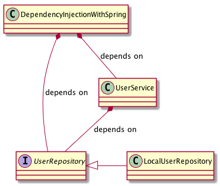

# Dependency Injection with and without Spring Boot

This project contains two packages: `nospring` and `withspring`.

Both packages implement a small demo application that uses depedency injection.
By comparing both packages one should be able to learn how Spring Boot works.

The `src/test/java` folder contains unit tests for both versions.
As the business logic isn't different, the tests are also the same.

The dependency graph of the `withspring` package looks like this:

